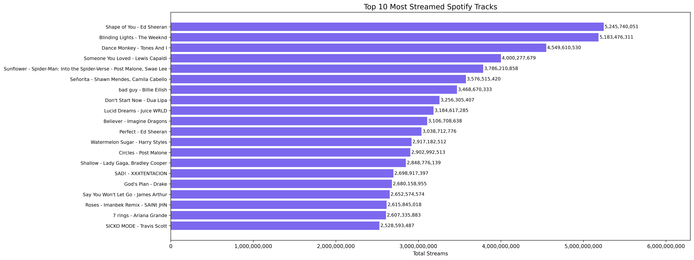

# 🎧 Spotify Streaming Trends (Portfolio Project)

This project explores global music trends using Spotify chart data.

## 🌐 Interactive Dashboard (Looker Studio)

Explore the full Top 20 Spotify Streaming Trends dashboard in Looker Studio:

🔗 [Click here to view the live dashboard](https://lookerstudio.google.com/reporting/74f9c702-dbed-4a31-9bbd-35e0bceef3cc)

## 💡 What I Did:
- Queried a public Spotify dataset using BigQuery (SQL)
- Visualized the top 10 streamed tracks using Python (matplotlib)
- Cleaned and styled the chart to be presentation-ready

## 📊 Sample Insight:
Top 10 streamed songs globally — saved as a visual here:

## 🔧 Tools Used:
- Google BigQuery
- Python (Pandas, Matplotlib)
- Google Cloud Notebooks

## 📁 File Structure:
- `spotify_trends.ipynb` → the notebook
- `charts/` → saved images
- `requirements.txt` → Python dependencies

---
Made with SQL, Python, and sheer determination.
